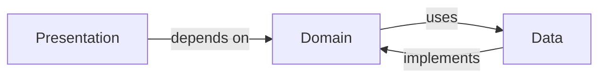

# Cryptobazzar — Rewrite (Clean Architecture) -

Cryptobazzar is a Flutter app refactored to follow Clean Architecture principles. The goal of this repository is to separate concerns, make business logic testable, and enable safe, incremental changes.

**Project Goals**

- **Separation of concerns:** Keep UI, business rules, and data access independent.
- **Testability:** Make domain logic easy to unit-test without Flutter dependencies.
- **Maintainability:** Use clear folder structure and DI to simplify future changes.

**Architecture Overview**

This project follows a Clean Architecture layering pattern:

- Presentation — UI, widgets, state management (Flutter-specific code)
- Domain — Entities, Use Cases / Interactors, pure Dart business logic
- Data — Repositories, DataSources, DTOs, mappers (network / local)

Folder mapping (lib/):

- `core/` — app-wide utilities, constants, DI configuration, network helpers
- `data/` — implementation of repositories, data sources, DTOs, mappers
- `domain/` — entities, repositories interfaces, usecases
- `presentation/` — pages, widgets, state management (bloc/provider/riverpod)

Dependency injection and wiring live in `core/di/` so each layer depends only on abstractions.

Mermaid diagram (high level):



**Design Decisions**

- Use repository interfaces in `domain/` so `presentation/` code never depends on concrete data implementations.
- Keep use cases as single-responsibility operations that orchestrate repository calls and business rules.
- Keep DTOs and mappers inside `data/` so conversion logic is localized.

**How to run**

1. Install Flutter and platform toolchains (Android / iOS / desktop) as needed.
2. Fetch dependencies:

```bash
flutter pub get
```

3. Run the app:

```bash
flutter run
```

**Testing**

Run unit and widget tests with:

```bash
flutter test
```

Put pure domain tests under `test/domain/` to avoid Flutter dependencies.

**Development workflow**

- Add new features by creating UseCases in `domain/`, repository interfaces there, then implement those interfaces in `data/` and wire them via `core/di/`.
- Keep UI logic in `presentation/` with thin controllers or blocs that call use cases.

**Contributing**

Contributions are welcome. Open issues for design discussions and create small, focused PRs that include tests for domain logic.

**References**

- Uncle Bob's Clean Architecture: https://8thlight.com
- Flutter architecture patterns and testing docs: https://docs.flutter.dev

---

This README is focused on architecture and developer guidance. For project-specific docs (API keys, assets, CI), add separate markdown files under `docs/`.
